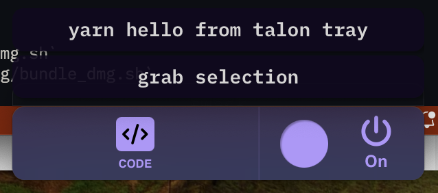

# Talon Tray

A tiny [Tauri](https://tauri.app) desktop application displaying HUD information with [TalonVoice](https://talonvoice.com).

I built this application primarily for myself. It is unlikely to suit most people, and _may_ work on other platforms, but has only been tested on macOS. However I wanted to share it in case it's useful or inspires a better idea in someone.



## Getting Started

Development mode:

```
deno task tauri dev
```

Building the application:

```
deno task tauri build
```